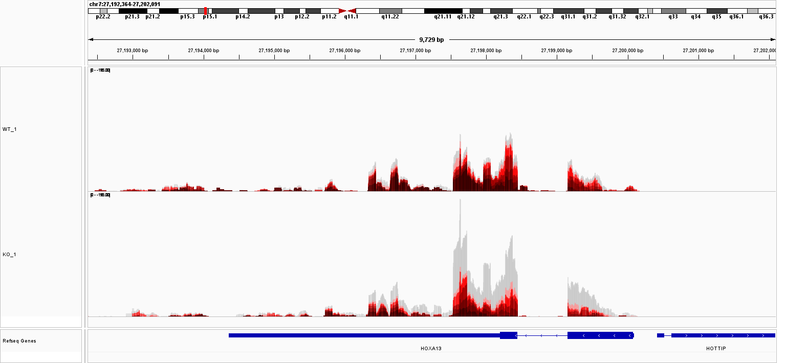
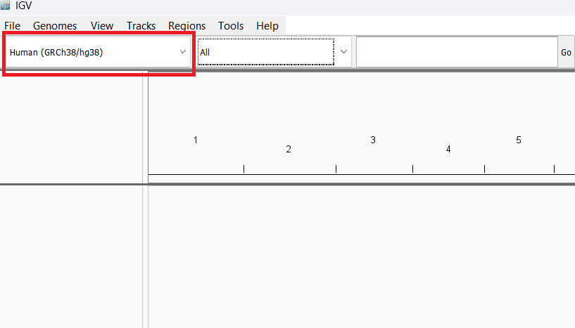
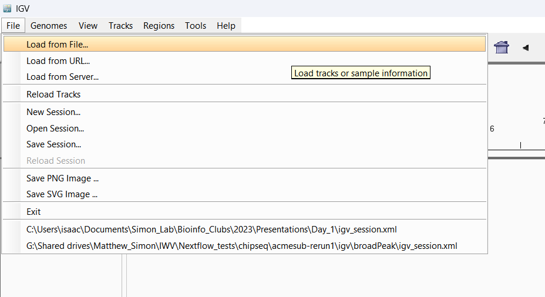
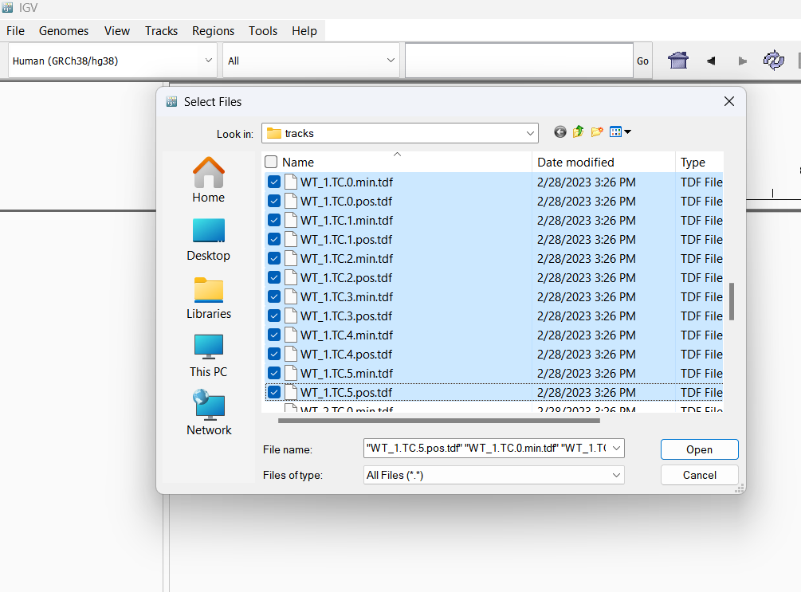
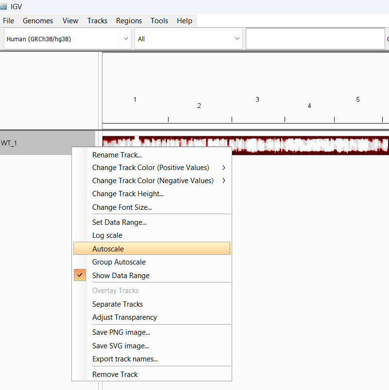
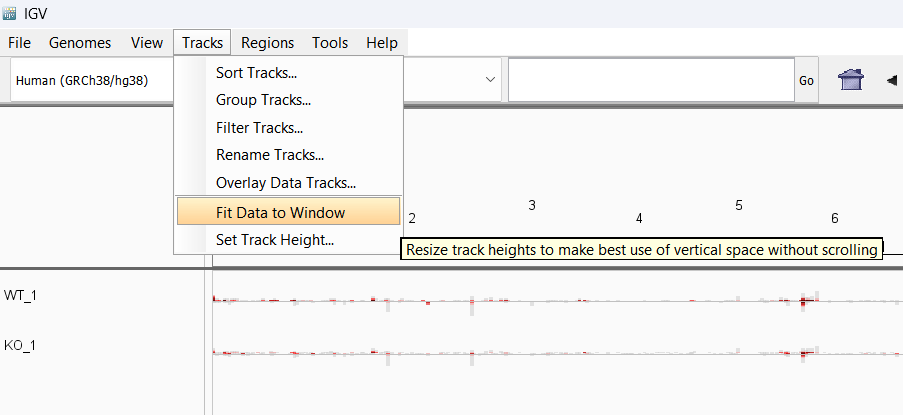
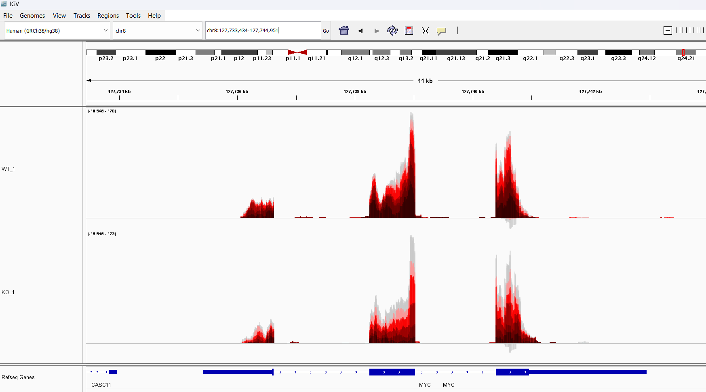

## Making Color-Coded Sequencing Tracks

As discussed briefly in [Output](output.md), one of the directories that bam2bakR will create in the `results/` directory is named `tracks`. This directory contains a number of .tdf files that can be loaded into igv. In this section, I will briefly describe how to make effective use of these tracks. An example of what these tracks should look like is presented below:



*Figure: Example tracks from a [published TimeLapse-seq dataset](https://pubs.acs.org/doi/10.1021/acs.biochem.0c00069). Top row is track for HOXA13 in WT HEK293T cells. Bottom row is track from DCP2 KO HEK293T cells. Stabilization of HOXA13 upon knockout of DCP2 is evident in the accumulation of predominantly gray (unmutated) reads.*

### File names

All .tdf files in the `tracks` directory will follow this naming convention: <sample name\>.<mutation type\>.<number of mutations\>.<strand\>. 

<sample name\> is the name you assigned to the relevant bam file in the config. For example, if the top of your config looks like:

``` yaml
samples:
  WT_1: data/samples/WT_replicate_1.bam
  WT_2: data/samples/WT_replicate_2.bam
  WT_ctl: data/samples/WT_nos4U.bam
```

then <sample name\> will be eiter `WT_1`, `WT_2`, or `WT_ctl`. Note, tracks are made for both +s4U and -s4U samples.

<mutation type\> is whatever you specified in the config under `mut_tracks`. If you specified "TC,GA", then there will be separate TC (colored by T-to-C mutations) and GA (colored by G-to-A mutations) .tdf files. TC tracks are colored with different shades of red while GA tracks are colored with different shades of blue. 

<number of mutations\> is the number of mutations in reads that contributed to this particular .tdf file. This number will range from 0 to 5. A value of 5 denotes reads with 5 **or more** mutations. For TC tracks, 0 mutation tracks are colored gray, and 1-5+ mutation tracks are colored with increasingly darker shades of red (with 5+ being the darkest). For GA tracks, 0 mutation tracks are still colored gray, but increasingly darker shades of blue are used for 1-5+ mutation tracks.

<strand\> is either pos (read maps to + strand of DNA) or min (read maps to - strand of DNA). In the example track at the top of this page, all reads being shown actually map to the - strand, but I have altered the scale to invert the track.

### Making tracks

Step 1: Install [IGV](https://software.broadinstitute.org/software/igv/download)

Step 2: Select a genome or upload your own



Step 3: Click `File > Load from File`, then select and upload all tracks of a particular sample and mutation type.





Step 4: Highlight all tracks (click top track then Shift + click bottom track), right click inside any of the highlighted rectangles containing the track names, and select `Overlay Tracks`.


Step 5: Change the track name to something informative (Right click track name > Rename Track).

Step 6: Autoscale track (Right click track name > Autoscale).



Step 7: Repeat steps 3-6 for all tracks you would like to compare

Step 8: Rescale size of tracks to fit the entire IGV window (Tracks > Fit Data to Window)



Step 9: Choose a gene/region of your choice and enjoy!

